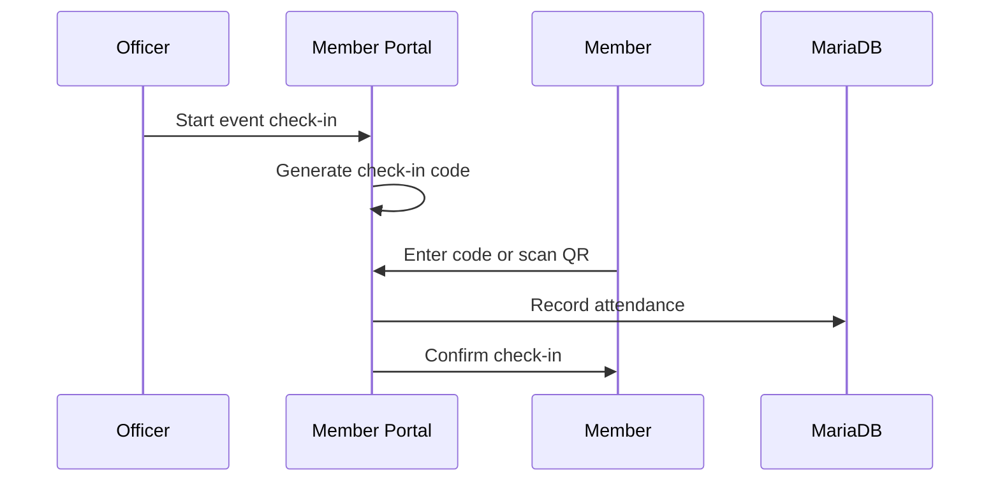

# Event Check-in Flow

This document describes how members check into events and how attendance is recorded.

## Overview

## Step-by-Step

### 1. Officer Starts Event Check-in

An officer navigates to the event in the [Member Portal](../internal-services/apps/member-portal.md) and clicks "Start Check-in". This generates:
- A short alphanumeric code (e.g., "ABC123")
- A QR code linking to the check-in page

**Services involved:**
- [Member Portal](../internal-services/apps/member-portal.md) (internal)

### 2. Check-in Code Distribution

The officer can:
- Display the QR code on a projector
- Announce the code verbally
- Share in Discord chat

### 3. Member Checks In

Members can check in by:
- **QR Code**: Scanning takes them directly to the check-in page
- **Manual Entry**: Navigate to `portal.ieeetamu.org/checkin` and enter the code

Members must be logged in to check in. If not logged in, they're prompted to authenticate.

**Services involved:**
- [Member Portal](../internal-services/apps/member-portal.md) (internal)

### 4. Attendance Recorded

The Portal records:
- Member ID
- Event ID
- Timestamp
- Check-in method (QR/code)

This data is stored in [MariaDB](../infrastructure/kubernetes/infra-services/mariadb.md).

**Services involved:**
- [Member Portal](../internal-services/apps/member-portal.md) (internal)
- [MariaDB](../infrastructure/kubernetes/infra-services/mariadb.md) (infrastructure)

### 5. Officer Ends Check-in

When the event is over, the officer clicks "End Check-in" to invalidate the code.

## Reporting

Officers can download attendance reports:
- Per-event attendance lists
- Member attendance history
- CSV export for records

## Related Documentation

- [Member Portal](../internal-services/apps/member-portal.md)
- [Event Creation Flow](./event-creation.md)
