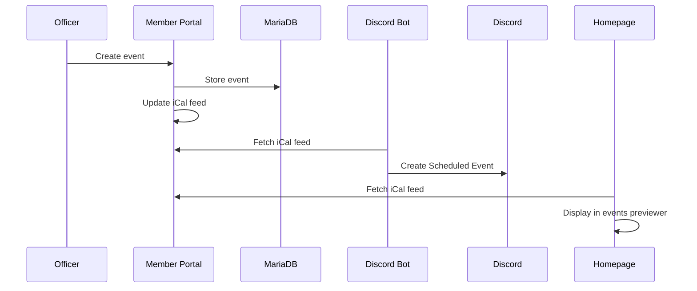

# Event Creation Flow

This document describes how officers create events and how they propagate to Discord and the website.

## Overview



## Step-by-Step

### 1. Officer Creates Event

An officer logs into the [Member Portal](../internal-services/apps/member-portal.md) and creates a new event with:
- Title and description
- Date, time, and duration
- Location
- Event type (general meeting, workshop, social, etc.)

**Services involved:**
- [Member Portal](../internal-services/apps/member-portal.md) (internal)
- [MariaDB](../infrastructure/kubernetes/infra-services/mariadb.md) (infrastructure)

### 2. iCal Feed Updated

The Portal maintains a public iCal feed that automatically includes all upcoming events. This feed is available at:
```
https://portal.ieeetamu.org/calendar.ics
```

**Services involved:**
- [Member Portal](../internal-services/apps/member-portal.md) (internal)

### 3. Discord Bot Syncs

The [Discord Bot](../internal-services/apps/discord-bot.md) periodically (every 10 minutes) fetches the iCal feed and:
- Creates new Discord Scheduled Events for new calendar entries
- Updates existing events if details change
- Deletes events that are removed from the calendar

Each Discord event includes a link back to the Portal for more details.

**Services involved:**
- [Discord Bot](../internal-services/apps/discord-bot.md) (internal)
- [Discord](../external-services/discord.md) (external)

### 4. Homepage Displays Events

The [Homepage](../internal-services/apps/homepage.md) fetches the iCal feed and displays upcoming events in the events previewer section.

**Services involved:**
- [Homepage](../internal-services/apps/homepage.md) (internal)

### 5. Members See Events

Members can now see events in multiple places:
- Discord Scheduled Events (with reminders)
- IEEE TAMU Homepage
- Personal calendar (by subscribing to the iCal feed)
- Member Portal directly

## Manual Sync Trigger

Officers can force an immediate Discord sync via the bot API:
```
POST http://discord-bot:3000/calendar/sync
```

Or through a Discord bot command if implemented.

## Related Documentation

- [Member Portal](../internal-services/apps/member-portal.md)
- [Discord Bot](../internal-services/apps/discord-bot.md)
- [Discord Calendar Sync Flow](./discord-calendar-sync.md)
- [Event Check-in Flow](./event-checkin.md)
