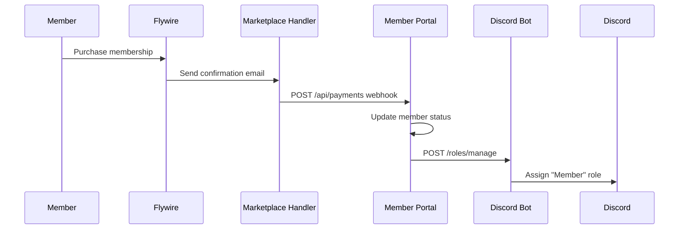

# Member Dues Payment Flow

This document describes the complete flow when a member pays their dues, from payment to receiving the Discord "Member" role.

## Overview



## Step-by-Step

### 1. Member Purchases Membership

The member navigates to the [IEEE TAMU Flywire store](https://sofctamu.estore.flywire.com/products?storeCatalog=23243) and completes the payment process.

**Services involved:**
- [Flywire](../external-services/flywire.md) (external)

### 2. Payment Confirmation Email

Flywire automatically sends a confirmation email to `marketplace-handler@ieeetamu.org`. This email contains:
- Member's name and email
- Transaction ID
- Payment amount
- Product purchased

**Services involved:**
- [Flywire](../external-services/flywire.md) (external)
- [Cloudflare Email Routing](../external-services/cloudflare.md) (routes to Worker)

### 3. Email Processing

The [Marketplace Handler Worker](../internal-services/workers/marketplace-handler.md) receives and processes the email:
- Verifies the sender is Flywire
- Parses the email content to extract transaction details
- If parsing fails, forwards to officers for manual review

**Services involved:**
- [Marketplace Handler](../internal-services/workers/marketplace-handler.md) (internal)
- [Cloudflare Workers](../external-services/cloudflare.md) (platform)

### 4. Portal Update

The Marketplace Handler makes an authenticated API call to the Member Portal:
```
POST https://portal.ieeetamu.org/api/payments
```

The Portal:
- Matches the payment to an existing member (by email) or creates a new record
- Updates payment status and membership expiration date
- Records the transaction for reporting

**Services involved:**
- [Member Portal](../internal-services/apps/member-portal.md) (internal)
- [MariaDB](../infrastructure/kubernetes/infra-services/mariadb.md) (infrastructure)

### 5. Discord Role Assignment

If the member has linked their Discord account in the Portal, the Portal calls the Discord Bot API:
```
POST http://discord-bot:3000/roles/manage
{
  "userId": "123456789",
  "roleName": "Member"
}
```

**Services involved:**
- [Member Portal](../internal-services/apps/member-portal.md) (internal)
- [Discord Bot](../internal-services/apps/discord-bot.md) (internal)

### 6. Role Applied

The Discord Bot uses the Discord API to assign the "Member" role to the user. The member now has access to member-only channels.

**Services involved:**
- [Discord Bot](../internal-services/apps/discord-bot.md) (internal)
- [Discord](../external-services/discord.md) (external)

## Error Handling

| Error | Handling |
|-------|----------|
| Email parsing fails | Email forwarded to officers for manual processing |
| Member not found in Portal | New member record created automatically |
| Discord account not linked | Payment recorded, role assigned when linked later |
| Discord Bot unavailable | Portal retries; manual role assignment as fallback |

## Related Documentation

- [Flywire](../external-services/flywire.md)
- [Marketplace Handler](../internal-services/workers/marketplace-handler.md)
- [Member Portal](../internal-services/apps/member-portal.md)
- [Discord Bot](../internal-services/apps/discord-bot.md)
