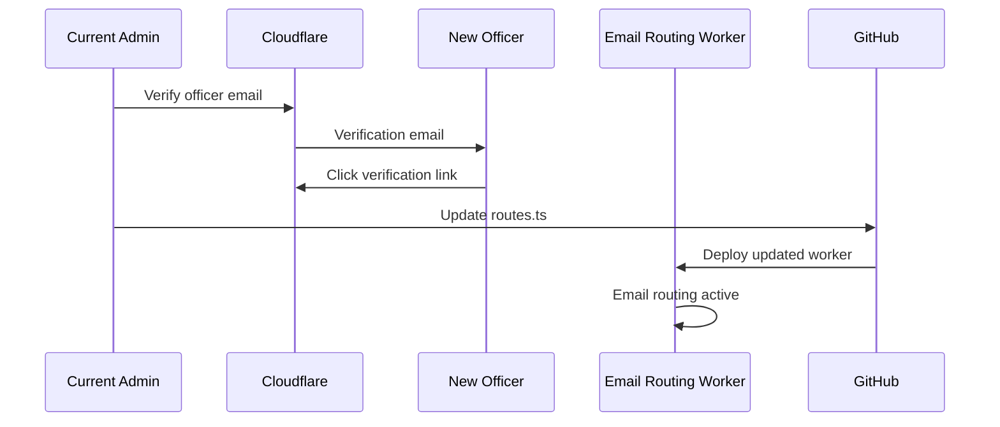

# Officer Email Setup Flow

This document describes how to set up `@ieeetamu.org` email forwarding for new officers.

## Overview



## Step-by-Step

### 1. Verify Destination Email

Before an email can be forwarded, Cloudflare must verify the officer's personal email address.

From the [email-routing repository](https://github.com/IEEE-TAMU/email-routing):

```bash
npm run add-email officer@tamu.edu
```

The officer will receive a verification email from Cloudflare.

**Services involved:**
- [Cloudflare](../external-services/cloudflare.md) (external)

### 2. Officer Confirms Verification

The new officer must click the verification link in the email from Cloudflare. This confirms they own the email address and consent to receiving forwarded mail.

### 3. Update Routing Configuration

Edit `src/routes.ts` in the email-routing repository to add the new route:

```typescript
{
  "destination": "newrole@ieeetamu.org",
  "recipients": ["officer@tamu.edu"]
}
```

Multiple recipients can be specified for shared roles:

```typescript
{
  "destination": "officers@ieeetamu.org",
  "recipients": ["president@tamu.edu", "vp@tamu.edu"]
}
```

**Services involved:**
- [GitHub](../external-services/github.md) (external)

### 4. Deploy Worker

Push the changes to the `main` branch. GitHub Actions will automatically deploy the updated worker to Cloudflare.

**Services involved:**
- [GitHub](../external-services/github.md) (external)
- [Email Routing Worker](../internal-services/workers/email-routing.md) (internal)
- [Cloudflare Workers](../external-services/cloudflare.md) (platform)

### 5. Test the Route

Send a test email to the new `@ieeetamu.org` address and verify it arrives at the officer's personal inbox.

## Offboarding Officers

When an officer leaves their role:

1. Remove their entry from `src/routes.ts`
2. (Optional) Remove their verified email to free up space:
   ```bash
   npm run delete-email officer@tamu.edu
   ```

## Troubleshooting

| Issue | Solution |
|-------|----------|
| Verification email not received | Check spam folder; retry `npm run add-email` |
| Emails not forwarding | Verify DNS MX records in [DNS Configuration](../infrastructure/cloudflare/dns.md) |
| Emails going to spam | Check SPF/DKIM records for forwarded domains |

## Related Documentation

- [Email Routing Worker](../internal-services/workers/email-routing.md)
- [Cloudflare](../external-services/cloudflare.md)
- [DNS Configuration](../infrastructure/cloudflare/dns.md)
